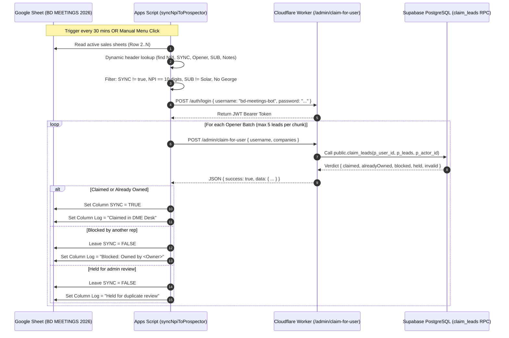

# Specification: BD MEETINGS Sheet ↔ Prospector Live Sync Bridge

**Status:** Current / Approved  
**Last Updated:** 2026-10-06  
**Audience:** Ben, Malak, Antigravity, Claude, Codex  

---

## 1. Executive Summary

This plan details the automated, real-time integration bridge between the **BD MEETINGS 2026** Google Spreadsheet and the **DME Desk Prospector** Cloudflare Worker backend (`https://dmedesk-prospector-api.malakadam246.workers.dev`).

The bridge automatically scans active meeting tabs, extracts pending NPI records, validates and qualifies them against campaign rules, and claims them in Prospector on behalf of the designated sales rep via the `POST /admin/claim-for-user` endpoint.

---

## 2. System Architecture



---

## 3. Configuration & Authentication

### 3.1 Integration Bot Account
The integration does not require personal teammate passwords or admin credentials. It uses the dedicated service bot in `public.app_users`:
- **Username**: `bd-meetings-bot`
- **User ID**: `ae8b7b1f-7c50-447c-a088-8fb95e3a86ee`
- **Permission**: `can_claim_for_others = true` (enforced at the database level by `sql/011_claim_for_user.sql`).

### 3.2 Google Apps Script Properties
Stored in **Project Settings > Script Properties** of the `BD MEETINGS 2026` Apps Script project:

| Property Key | Configured Value | Description |
|---|---|---|
| `PROSPECTOR_WORKER_URL` | `https://dmedesk-prospector-api.malakadam246.workers.dev` | Production Worker endpoint |
| `PROSPECTOR_BOT_USERNAME` | `bd-meetings-bot` | Integration bot username |
| `PROSPECTOR_BOT_PASSWORD` | `<secure_bot_password>` | Bot account password |
| `PROSPECTOR_USER_Ben` | `ben.arthur.wiz@gmail.com` | Opener "Ben" mapping |
| `PROSPECTOR_USER_Selene` | `selene.myles.wiz@gmail.com` | Opener "Selene" mapping |
| `PROSPECTOR_USER_Jimmy` | `jimmy.pearson.wiz@gmail.com` | Opener "Jimmy" mapping |
| `PROSPECTOR_USER_Jane` | `kaity.james.wiz@gmail.com` | Opener "Jane" mapping (Kaity James) |
| `PROSPECTOR_USER_Judy` | `nora.atkins.wiz@gmail.com` | Opener "Judy" mapping |
| `PROSPECTOR_USER_DEFAULT` | `ben.arthur.wiz@gmail.com` | Fallback for unassigned/blank openers |

---

## 4. Google Apps Script Implementation (`code.js`)

The existing sync function in `BD MEETINGS 2026/src/code.js` requires three critical enhancements:

### 4.1 Problem in Existing Code
1. **Hardcoded Column Indices**:
   The current script hardcodes:
   ```javascript
   var NPI_COL = 19; // Col S
   var SYNC_COL = 20; // Col T
   var OPENER_COL = 2; // Col B (BUG: in Onboarded, Opener is Column D / Col 4)
   var COMPANY_COL = 5; // Col E (BUG: in Onboarded, Company is Column G / Col 7)
   var PHONE_COL = 7; // Col G (BUG: in Onboarded, Phone is Column I / Col 9)
   ```
   Because sheet tabs contain varying prefixes (e.g. `MEDB`, `PPO`), these hardcoded indices misread phone numbers as company names and skip valid openers.

2. **Missing Filters**:
   It does not filter out `SUB: Solar` or rows involving George.

3. **Thin Payload**:
   It omits status (`Onboarded`), notes, and authorized contacts.

### 4.2 Enhanced Implementation Logic

```javascript
/**
 * Resolves column indices dynamically from row 1 headers.
 */
function getColumnIndexMap_(headerRow) {
  var map = {};
  headerRow.forEach(function(col, idx) {
    var title = String(col || '').trim().toLowerCase();
    if (title === 'npi') map.npi = idx + 1;
    else if (title === 'sync') map.sync = idx + 1;
    else if (title === 'opener') map.opener = idx + 1;
    else if (title.indexOf('company') !== -1) map.company = idx + 1;
    else if (title === 'sub') map.sub = idx + 1;
    else if (title === 'phone') map.phone = idx + 1;
    else if (title === 'email') map.email = idx + 1;
    else if (title.indexOf('authorized') !== -1) map.authPerson = idx + 1;
    else if (title.indexOf('opener summary') !== -1) map.openerSummary = idx + 1;
    else if (title.indexOf('closer') !== -1) map.closerNotes = idx + 1;
    else if (title === 'status') map.status = idx + 1;
    else if (title === 'log') map.log = idx + 1;
  });
  return map;
}

/**
 * Enhanced sync function with dynamic headers and qualification rules.
 */
function syncNpiToProspector() {
  var props = PropertiesService.getScriptProperties();
  var workerUrl = (props.getProperty('PROSPECTOR_WORKER_URL') || '').replace(/\/$/, '');
  var botUsername = props.getProperty('PROSPECTOR_BOT_USERNAME');
  var botPassword = props.getProperty('PROSPECTOR_BOT_PASSWORD');
  var defaultUser = props.getProperty('PROSPECTOR_USER_DEFAULT') || 'ben.arthur.wiz@gmail.com';

  if (!workerUrl || !botUsername || !botPassword) {
    Logger.log('Prospector sync: Missing credentials in Script Properties.');
    return;
  }

  var SYNC_SHEETS = [
    'New Meetings', 'Follow Ups', 'Onboarded',
    'Invoice Sent', 'Contract Sent', 'No-Show'
  ];

  var ss = SpreadsheetApp.getActiveSpreadsheet();
  var byOpener = {};

  SYNC_SHEETS.forEach(function(sheetName) {
    var sheet = ss.getSheetByName(sheetName);
    if (!sheet || sheet.getLastRow() < 2) return;

    var numRows = sheet.getLastRow();
    var numCols = sheet.getLastColumn();
    var rawValues = sheet.getRange(1, 1, numRows, numCols).getValues();
    var colMap = getColumnIndexMap_(rawValues[0]);

    if (!colMap.npi || !colMap.sync) return;

    for (var i = 1; i < rawValues.length; i++) {
      var row = rawValues[i];
      var isSynced = row[colMap.sync - 1];
      if (isSynced === true) continue;

      var npi = String(row[colMap.npi - 1] || '').trim().replace(/\D/g, '');
      if (npi.length !== 10) continue;

      var sub = colMap.sub ? String(row[colMap.sub - 1] || '').trim().toLowerCase() : '';
      if (sub === 'solar') continue; // Skip solar

      var opener = colMap.opener ? String(row[colMap.opener - 1] || '').trim() : '';
      var rowText = JSON.stringify(row).toLowerCase();
      if (opener.toLowerCase() === 'george' || rowText.indexOf('george') !== -1) continue; // Skip George

      // Resolve username (with fallback)
      var dmeUsername = props.getProperty('PROSPECTOR_USER_' + opener) || defaultUser;

      var company = colMap.company ? String(row[colMap.company - 1] || '').trim() : '';
      var phone = colMap.phone ? String(row[colMap.phone - 1] || '').trim() : '';
      var email = colMap.email ? String(row[colMap.email - 1] || '').trim() : '';
      var contact = colMap.authPerson ? String(row[colMap.authPerson - 1] || '').trim() : '';
      var sheetStatus = colMap.status ? String(row[colMap.status - 1] || '').trim() : sheetName;

      var summary = colMap.openerSummary ? String(row[colMap.openerSummary - 1] || '').trim() : '';
      var notes = colMap.closerNotes ? String(row[colMap.closerNotes - 1] || '').trim() : '';

      var fullNotes = [];
      if (sub) fullNotes.push('SUB: ' + sub.toUpperCase());
      if (opener) fullNotes.push('Opener: ' + opener);
      if (contact) fullNotes.push('Authorized Person: ' + contact);
      if (summary) fullNotes.push('Opener Summary:\n' + summary);
      if (notes) fullNotes.push("Closer's Notes:\n" + notes);

      if (!byOpener[dmeUsername]) byOpener[dmeUsername] = [];
      byOpener[dmeUsername].push({
        sheet: sheet,
        rowIndex: i + 1,
        syncCol: colMap.sync,
        logCol: colMap.log,
        npi: npi,
        company: {
          npi: npi,
          name: company,
          phone: phone,
          email: email,
          authorizedOfficial: contact,
          status: sheetStatus || 'Onboarded',
          notes: fullNotes.join('\n\n')
        }
      });
    }
  });

  // Login bot once
  var token = loginBot_(workerUrl, botUsername, botPassword);
  if (!token) return;

  // Process claims in chunks of 5 per user
  Object.keys(byOpener).forEach(function(username) {
    var items = byOpener[username];
    for (var c = 0; c < items.length; c += 5) {
      var chunk = items.slice(c, c + 5);
      claimChunk_(workerUrl, token, username, chunk);
    }
  });
}
```

---

## 5. Worker Optimization (`POST /admin/claim-for-user`)

To ensure that custom statuses (`Onboarded`) and notes passed from BD MEETINGS are not dropped during claim ingestion:

### Update `worker/src/repos/leadsRepo.js`
In `toCompany()` and `companiesToClaimItems()`:
```javascript
function companyToLeadRow(company, session, { status, isDisconnected }) {
  const flat = company;
  const now = new Date().toISOString();
  return {
    ...
    status: flat.status || status || "new",
    notes: flat.notes || "",
    meeting_opener_notes: flat.meetingOpenerNotes || "",
    ...
  };
}
```

---

## 6. Feedback & Sheet Write-Back

For each processed row:
- **Success (`claimedNpis` or `alreadyClaimedNpis`)**:
  - `SYNC` (Column T): Checked `TRUE`
  - `Log` (Column R): `"Claimed in DME Desk"` (or `"Already owned"`)
- **Blocked (`blocked`)**:
  - `SYNC`: Remains unchecked
  - `Log`: `"Blocked: Owned by " + owners.join(', ')`
- **Held for Review (`heldForReview`)**:
  - `SYNC`: Remains unchecked
  - `Log`: `"Held for admin review (possible duplicate)"`

---

## 7. Deployment & Verification Roadmap

### Step 1: Worker Support Validation
- Verify `worker/src/repos/leadsRepo.js` accepts `status` and `notes` payloads.
- Run tests: `npm test` in `worker/`.

### Step 2: Apps Script Deployment
- Pull and update `C:\Users\ben.arthur\Desktop\BD MEETINGS 2026\src\code.js`.
- Push to Google Apps Script using clasp:
  ```powershell
  & "C:\Users\ben.arthur\node-v24.14.1-win-x64\node.exe" `
    "C:\Users\ben.arthur\node-v24.14.1-win-x64\node_modules\@google\clasp\build\src\index.js" `
    push
  ```

### Step 3: Trigger & Manual Verification
- In the spreadsheet, run `setupProspectorSyncTrigger()` to ensure the 30-minute recurring trigger is active.
- Perform a manual test run on an unchecked row to confirm the `SYNC` checkbox flips to `TRUE` and the lead appears in Prospector under the expected sales rep.
