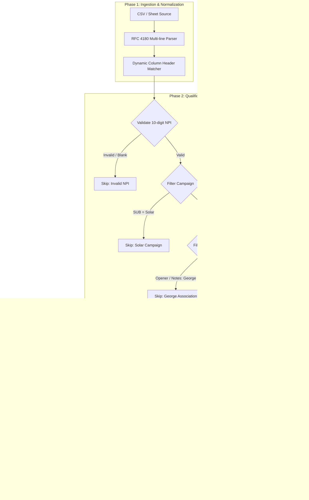

# Specification: Sheet Lead Import & Claiming Protocol

**Status:** Current / Approved  
**Last Updated:** 2026-10-06  
**Audience:** Ben, Malak, Antigravity, Claude, Codex  

---

## 1. Executive Summary

This protocol defines the standardized, repeatable process and CLI tooling for extracting leads from any BD Google Sheet / CSV export (such as the `Onboarded`, `Contract Sent`, or `Follow Ups` tabs) and importing them into the DME Desk Prospector database (`public.leads`).

### Core Invariants
1. **Existing leads are never overwritten**: Any NPI already claimed by an active sales rep retains its existing ownership.
2. **Business grouping is preserved**: Claims run through the group-aware `claim_leads` RPC, linking branch locations and shared authorized officials.
3. **Audit trails are intact**: All claims record the execution actor (`claim_for_user`), maintaining compliance.
4. **Data timeouts are prevented**: Individual NPI processing prevents PostgREST statement timeouts on complex identity-group evaluations.

---

## 2. End-to-End Workflow Architecture



---

## 3. Data Schema & Field Mappings

### 3.1 Dynamic Header Mapping
Sheets and CSV exports occasionally add or shift columns (e.g. adding `MEDB` or `PPO`). The protocol **must not** rely on hardcoded column indices. Headers are matched by normalized lower-case regex patterns:

| Canonical Field | Target Match Regex | Sample CSV Column |
|---|---|---|
| `npi` | `/^npi$/i` | `NPI` |
| `opener` | `/^opener$/i` | `Opener` |
| `company_name` | `/^company\s*name$/i` | `Company Name` |
| `sub` | `/^sub$/i` | `SUB` |
| `status` | `/^status$/i` | `Status` |
| `date_added` | `/^date\s*added$/i` | `Date Added` |
| `authorized_person` | `/^authorized\s*person$/i` | `Authorized Person` |
| `phone` | `/^phone$/i` | `Phone` |
| `email` | `/^email$/i` | `EMAIL` |
| `meeting_time` | `/^meeting\s*time$/i` | `Meeting Time` |
| `opener_summary` | `/^opener\s*summary$/i` | `Opener Summary` |
| `closer_notes` | `/^closer('?s)?\s*notes$/i` | `Closer's Notes` |
| `sync` | `/^sync$/i` | `SYNC` |

### 3.2 Opener Resolution Matrix
Opener names found in the sheet are mapped to active accounts in `public.app_users`:

| Sheet Opener Value | Prospector Username | Target Display Name | Target UUID |
|---|---|---|---|
| `Ben` | `ben.arthur.wiz@gmail.com` | Ben Arthur | `acc67fc0-6963-4c3a-8a33-06722e0c6fe4` |
| `Selene` | `selene.myles.wiz@gmail.com` | Selene Myles | `1d94e105-c38c-4eb6-b268-d168fab3956b` |
| `Jimmy` | `jimmy.pearson.wiz@gmail.com` | Jimmy Pearson | `1e4caf69-6980-4b87-afa2-fbf581d2ce0b` |
| `Jane` | `kaity.james.wiz@gmail.com` | Kaity James | `7dbfbc63-1bfe-49f2-816f-5696d4a6e9b1` |
| *(Empty / Blank)* | `ben.arthur.wiz@gmail.com` | Ben Arthur (Admin Fallback) | `acc67fc0-6963-4c3a-8a33-06722e0c6fe4` |

---

## 4. Qualification & Filter Logic

Before touching the database, candidate rows are evaluated through four sequential gatekeepers:

1. **Gate 1: NPI Validation**
   - Clean non-digits: `npi.replace(/\D/g, '')`.
   - Length check: Must be exactly 10 digits. Blank or header delimiter rows (e.g. `2025 -`, `2026 -`) are discarded immediately.

2. **Gate 2: Campaign Exclusions**
   - If `sub.toLowerCase().trim() === 'solar'`, skip the record.

3. **Gate 3: Rep & George Exclusions**
   - Check `opener.toLowerCase().trim() === 'george'`.
   - Check if row JSON text contains `george` (case-insensitive) in closer notes, summary, or authorized contact.
   - If true, skip the record.

4. **Gate 4: Pre-existing Claim Check**
   - Perform batch query:
     ```sql
     select npi, claimed_by, is_disconnected 
     from public.leads 
     where npi in (<candidate_npis>);
     ```
   - If an NPI is already in `leads` (with `claimed_by is not null` and `is_disconnected = false`), **do not overwrite**. Log as `PRESERVED_EXISTING`.

---

## 5. Enrichment & Structured Lead Assembly

For each qualified, unclaimed lead:
1. **NPPES Provider Data (`public.npi_records`)**:
   Query `public.npi_records` by NPI to retrieve:
   - Official provider legal/DBA name (`name`)
   - Practice address (`address_line1`, `address_city`, `address_state`, `address_postalcode`)
   - Primary phone (`phone`)
   - Authorized official first & last name, credential, title, and phone
   - Taxonomy description and code

2. **Synthesize Notes (`lead.notes`)**:
   Preserve historical context into a cleanly formatted multi-section note:
   ```text
   SUB: <SUB>
   Opener: <Opener>
   Date Added: <Date Added>
   Meeting Time: <Meeting Time>
   Authorized Person: <Authorized Person>

   Opener Summary:
   <Opener Summary text>

   Closer's Notes:
   <Closer's Notes text>
   ```

3. **Lead Record DTO**:
   Construct the payload for `claim_leads`:
   ```json
   {
     "npi": "1134722390",
     "identity": {
       "name": "CLAYTON MEDICAL SUPPLY INC",
       "state": "GA",
       "phone": "4048085118",
       "officialName": "Judith Fairclough",
       "officialPhone": "4048085118"
     },
     "lead": {
       "npi": "1134722390",
       "company_name": "CLAYTON MEDICAL SUPPLY INC",
       "phone": "404-808-5118 / 7709975660",
       "email": "user@example.com",
       "address_line1": "...",
       "city": "...",
       "state": "GA",
       "postal_code": "...",
       "specialty": "ORT+CGM",
       "contact_name": "Judith Fairclough",
       "contact_role": "authorized official",
       "contact_source": "nppes",
       "status": "Onboarded",
       "notes": "...",
       "meeting_opener_notes": "...",
       "is_disconnected": false
     }
   }
   ```

---

## 6. Execution via `claim_leads` RPC

### 6.1 Database Function Call
To respect business grouping, audit logs, and deduplication triggers, the import invokes the PostgreSQL RPC:

```http
POST /rest/v1/rpc/claim_leads
Content-Type: application/json
apikey: <SUPABASE_SERVICE_ROLE_KEY>
Authorization: Bearer <SUPABASE_SERVICE_ROLE_KEY>

{
  "p_user_id": "<target_user_uuid>",
  "p_leads": [ <single_lead_item> ],
  "p_actor_id": "acc67fc0-6963-4c3a-8a33-06722e0c6fe4",
  "p_dry_run": false
}
```

### 6.2 Sequential Loop Execution
- Claims must be executed **sequentially (1-by-1)** with a small sleep delay (~50ms) between calls.
- **Rationale**: Batching $>5$ leads into a single `claim_leads` call triggers comprehensive recursive identity-tree searches and lock resolution that causes PostgREST statement timeouts (`canceling statement due to statement timeout`, error code `57014`).

---

## 7. Implementation: CLI Tooling

The protocol is formalized as an automated CLI script:
[`scripts/import-bd-sheet.mjs`](../../scripts/import-bd-sheet.mjs).

### Usage
```powershell
# 1. Dry run (verifies without writing to DB)
& "C:\Users\ben.arthur\node-v24.14.1-win-x64\node.exe" scripts/import-bd-sheet.mjs "path/to/file.csv" --dry-run

# 2. Live execution
& "C:\Users\ben.arthur\node-v24.14.1-win-x64\node.exe" scripts/import-bd-sheet.mjs "path/to/file.csv" --apply
```
